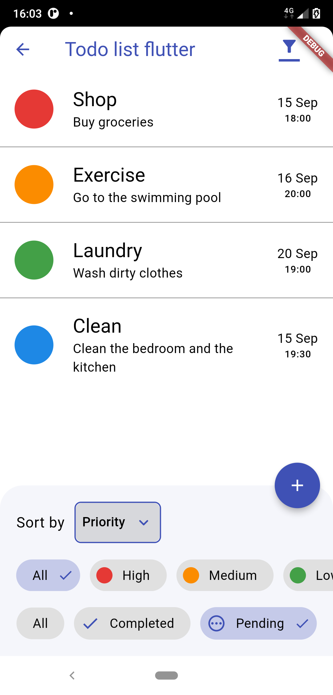
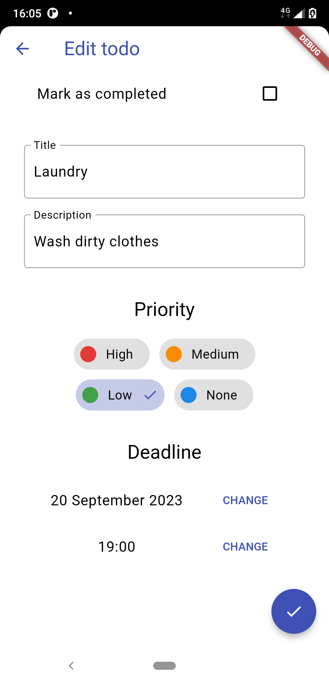
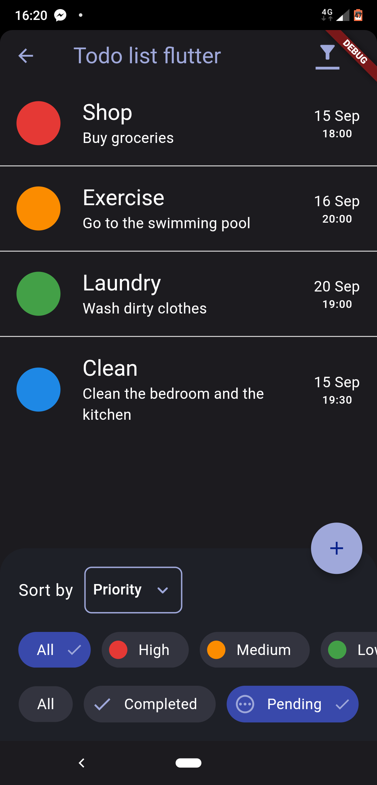

# Todo app flutter

### A basic Todo app done with the [Flutter](https://docs.flutter.dev/ui) framework. 

This app allows to read, create, update and delete todos. 
It also allows to filter and sort todos. It was created to mimic
the Todo app Compose

Other features:

* Night mode 🌙
* Transitions between routes
* Swipe to delete todo
* Click and hold to mark todo as done
* Filter for todos is saved in the Shared preferences
	

Done with the **MVVM** pattern. Also uses Material 3. 🎨

## Compatibility

Only works on Android api >=21, iOS and macOS because of the sqflite dependency.
Only the android version has been tested.

## Screenshots

